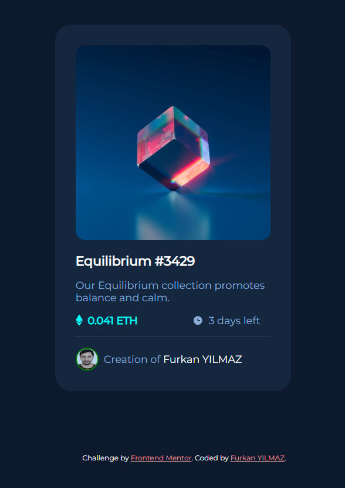

# Frontend Mentor - NFT preview card component solution

This is a solution to the [NFT preview card component challenge on Frontend Mentor](https://www.frontendmentor.io/challenges/nft-preview-card-component-SbdUL_w0U). 
## Table of contents

- [Overview](#overview)
  - [Screenshot](#screenshot)
  - [Links](#links)
- [My process](#my-process)
  - [Built with](#built-with)
  - [What I learned](#what-i-learned)
- [Author](#author)
- [Acknowledgments](#acknowledgments)


## Overview


### Screenshot



### Links

- Solution URL: [](https://github.com/frkanyilmaz2/nft-preview)
- Live Site URL: [](https://frkanyilmaz2.github.io/nft-preview/)

## My process

### Built with

- Semantic HTML5 markup
- CSS custom properties
- Flexbox

### What I learned

I was feeling addictive to 
```
random-name{
  position:absolute;
  left:50%;
  top: 50%;
  transform:translate(-50%;-50%)
}
```
This code makes the .random-name both horizontally and vertically centered. I used this so much that it starting to feel like cheesy. So I tried a different approach and put .random-name inside a container then used flex to center everything. I'll keep using this strategy until it gives cheese vibe.

### Useful resources

- [Example resource 1](https://www.example.com) - This helped me for XYZ reason. I really liked this pattern and will use it going forward.
- [Example resource 2](https://www.example.com) - This is an amazing article which helped me finally understand XYZ. I'd recommend it to anyone still learning this concept.

